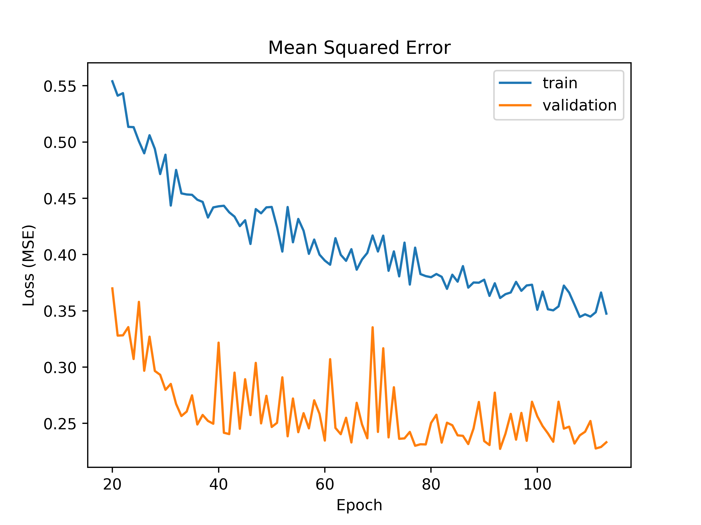
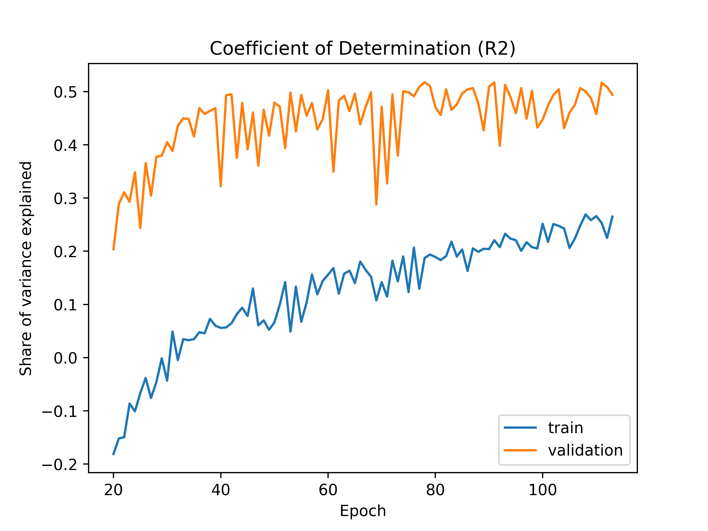

This program attempts to model an Air Force developmental education selection board process using a deep learning neural network. These selection boards are a highly standardized, labor-intensive process in which a small group of Air Force officers are asked to review all \~1,000 applicants' materials (\~50pgs/person), providing an assessment score ranging between 6 and 10 in half-point increments. Scores for each applicant are adjusted and averaged for a final score. Using previous assessment data and digitized personnel records, this program attempts to replicate board results to demonstrate the potential for machine learning in this process.

### Network architecture
This program uses the Tensorflow Keras Model class with a linear activation as the final output layer, mean squared error (MSE) as the loss function, and the Adam optimizer. Personnel data contain several hundred numeric and categorical features, as well as one free text field.

To accelerate training time, we train two separate neural networks. The first network uses a Bidirectional Encoder Representations from Transformers (BERT) input layer for the free text field, followed by four densely-connected layers. After a few training epochs, a 1D vector of predictions from this network is supplied to the second network as an additional feature.

The second network consists of an input layer of categorical features and another input layer of numeric features (plus the predicted scores from the first network). Each categorical feature is embedded in N = round(sqrt(unique_values)) vectors to allow higher-dimensional features more space to train. These are followed by three dense layers that include dropout and L2 regularization. The network also uses early stoppage to reduce overfitting.

### Performance
##### Loss (MSE)

##### R-squared

